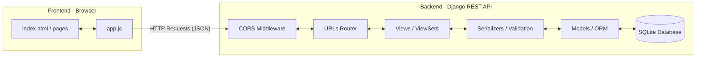

# Meeting Room Reservation System — Backend Architecture & Presentation Guide

This document is a comprehensive guide to the backend codebase of the **Meeting Room Reservation System**. It explains the architecture, the backend folder structure, the purpose of every file, how data validation works, and how the frontend connects to the backend APIs.

---

## 1. System Architecture Overview

The application follows a **decoupled Client-Server architecture**:
*   **Backend (Server)**: A RESTful API built using **Python 3**, **Django**, and **Django REST Framework (DRF)**. It stores data in an SQLite database, manages business logic, validates constraints (e.g., overlapping meetings), and exposes endpoints.
*   **Frontend (Client)**: A lightweight, responsive web app built using **static HTML/CSS/Vanilla Javascript**. It runs directly in the browser and interacts with the backend asynchronously using the browser's native `fetch()` API.



---

## 2. Backend Directory Structure & File Explanations

Below is the directory layout of the `/backend` folder, showing the purpose of each file and folder:

```text
backend/
│
├── manage.py                  # Django's primary command-line utility
├── db.sqlite3                 # The SQLite database file (where data is stored)
├── .env                       # Environment configuration file (ignored by git)
├── .env.example               # Template showing example env variables
│
├── backend/                   # Project configuration app
│   ├── __init__.py            # Tells Python that this folder is a package
│   ├── settings.py            # Main settings and configuration file
│   ├── urls.py                # Core URL routing configurations
│   ├── wsgi.py                # WSGI entry-point for synchronous web servers
│   └── asgi.py                # ASGI entry-point for asynchronous web servers
│
└── reservations/              # The reservations application app
    ├── __init__.py            # Tells Python that this folder is a package
    ├── admin.py               # Configures tables inside Django's admin portal
    ├── apps.py                # Configures the metadata of the reservations app
    ├── models.py              # Defines the database schema (Room, Reservation)
    ├── serializers.py         # Transforms models to JSON and handles validations
    ├── views.py               # Contains the REST API endpoints and view handlers
    ├── urls.py                # Local API URL routing for this application
    ├── tests.py               # Code checking correctness of validators and APIs
    │
    ├── fixtures/              # Pre-configured seed data
    │   └── rooms.json         # Seeds the database with default room records
    │
    └── migrations/            # Auto-generated database schema history files
        └── __init__.py
```

### Detailed File Explanations:
*   **`manage.py`**: A helper script that lets you interact with Django (run servers, run test suites, apply migrations, seed databases).
*   **`db.sqlite3`**: The lightweight database. All rooms, reservations, and Django admin accounts are saved directly inside this file.
*   **`.env` / `.env.example`**: Configures database paths, debug keys, and server security settings.
*   **`backend/settings.py`**: Registers installed libraries (e.g., `rest_framework`, `corsheaders`), hooks up CORS middleware so the frontend can query the API, loads `.env` variables, and sets up database drivers.
*   **`backend/urls.py`**: Tells Django to forward any URL matching `/api/` to the `reservations` app's router, and `/admin/` to the admin page.
*   **`backend/wsgi.py` / `asgi.py`**: Used when deploying Django to production servers (like Gunicorn, uWSGI, or Daphne).
*   **`reservations/admin.py`**: Registers the `Room` and `Reservation` models inside Django's built-in administration dashboard (`http://localhost:8000/admin/`).
*   **`reservations/models.py`**: Defines how room details and reservations are structured in SQLite tables.
*   **`reservations/serializers.py`**: Formats JSON data, maps dates/times to Javascript fields, and enforces business rules (preventing double-booking).
*   **`reservations/views.py`**: Combines serializers and database models to serve lists, detail pages, creations, and deletion endpoints.
*   **`reservations/urls.py`**: Houses the REST API router routes (`/api/rooms/`, `/api/reservations/`).
*   **`reservations/fixtures/rooms.json`**: Pre-configured JSON data containing initial rooms (Room A, Room B, Room C) loaded with `loaddata`.
*   **`reservations/migrations/`**: Automatically keeps track of modifications you make to database schemas over time.

---

## 3. The Core Database Models (`models.py`)

File Location: [models.py](file:///c:/Users/User/meeting-room-reservation/backend/reservations/models.py)

Django's Object-Relational Mapper (ORM) defines two main database tables using Python classes:

### `Room`
Represents a physical meeting room.
*   `name`: A unique text field specifying the room's name (e.g., "Room A").
*   `capacity`: An integer representing the maximum number of people allowed in the room.

### `Reservation`
Represents a booked slot for a particular room.
*   `room`: A foreign key linking to a `Room` instance. `on_delete=models.CASCADE` ensures that if a room is deleted, all its reservations are deleted automatically.
*   `name`: The name of the person or team booking the room.
*   `date`: The date of the reservation.
*   `start_time` / `end_time`: Time slot boundaries.
*   `attendees`: The number of people attending the meeting.

---

## 4. Data Serialization & Business Logic (`serializers.py`)

File Location: [serializers.py](file:///c:/Users/User/meeting-room-reservation/backend/reservations/serializers.py)

Serializers act as translation layers. They convert database objects into JSON format for outgoing responses, and validate incoming JSON data before saving it to the database.

### Key Features of `ReservationSerializer`:
1.  **Field Mapping**: Map Python snake_case variables to Javascript camelCase fields:
    *   `start_time` $\rightarrow$ `startTime`
    *   `end_time` $\rightarrow$ `endTime`
2.  **Read-Only Helper Fields**: Expose the related room's name (`room_name`) directly on the reservation object so the frontend doesn't need to make a separate query.

### Business Rules & Validations (`validate()` method):
The serializer runs three critical validation checks before writing to the database:
*   **Time Sequence Rule**: Confirms that `end_time` is strictly after `start_time`.
*   **Capacity Rule**: Compares the requested number of `attendees` with the target room's maximum capacity, rejecting the booking if the room is too small.
*   **Overlap Prevention Rule**: Queries the database to check if the target room is already booked on the specified date during the requested time window. The overlap formula checks if:
    $$\text{existing.start\_time} < \text{new.end\_time} \quad \text{and} \quad \text{new.start\_time} < \text{existing.end\_time}$$

---

## 5. REST API Views & ViewSets (`views.py`)

File Location: [views.py](file:///c:/Users/User/meeting-room-reservation/backend/reservations/views.py)

ViewSets determine how URLs respond to HTTP requests. By using Django REST Framework's class-based views, we avoid writing boilerplate CRUD code.

### `RoomViewSet`
*   Inherits from `ReadOnlyModelViewSet`.
*   Only allows read actions (`GET` request to list rooms or retrieve a single room). Writing/modifying rooms through the public API is blocked.

### `ReservationViewSet`
*   Inherits from `ModelViewSet` to provide full CRUD support (`GET`, `POST`, `PUT`, `PATCH`, `DELETE`).
*   **Custom Filtering**: Overrides `get_queryset()` to allow filtering reservations by date via query parameters (e.g., `/api/reservations/?date=2026-06-23`), which is used by the frontend calendar view.

---

## 6. URL Routing configuration (`urls.py`)

File Locations:
1.  **App Router**: [reservations/urls.py](file:///c:/Users/User/meeting-room-reservation/backend/reservations/urls.py)
2.  **Project Root URLs**: [backend/urls.py](file:///c:/Users/User/meeting-room-reservation/backend/backend/urls.py)

Routing maps incoming request URIs directly to the ViewSets:
*   `GET /api/rooms/` $\rightarrow$ Lists all rooms.
*   `GET /api/reservations/` $\rightarrow$ Lists reservations.
*   `POST /api/reservations/` $\rightarrow$ Creates a reservation.
*   `DELETE /api/reservations/<id>/` $\rightarrow$ Cancels/deletes a reservation.

The project uses DRF's `DefaultRouter`, which automatically registers standard REST paths.

---

## 7. Environment and Settings Setup (`settings.py`)

File Location: [settings.py](file:///c:/Users/User/meeting-room-reservation/backend/backend/settings.py)

To ensure the backend is secure and easy to deploy, we updated `settings.py` to decouple code from configurations:

### Dynamic `.env` Loading
At the top of `settings.py`, we parse the `.env` configuration file if it exists, loading environment variables into Python's `os.environ` dict:
```python
env_path = BASE_DIR / '.env'
if env_path.exists():
    with open(env_path, 'r', encoding='utf-8') as f:
        for line in f:
            line = line.strip()
            if line and not line.startswith('#') and '=' in line:
                key, val = line.split('=', 1)
                os.environ[key.strip()] = val.strip().strip("'").strip('"')
```

### Decoupled Settings
*   `SECRET_KEY`: Retrieved via `os.environ.get('SECRET_KEY')`. For security, there is **no hardcoded fallback key** in `settings.py`. If `SECRET_KEY` is not defined in the environment, the application will raise an `ImproperlyConfigured` exception and refuse to start, preventing accidental exposure.
*   `DEBUG`: Controlled via the environment variable, defaulting to `False` if not specified to prevent running in debug mode in production.
*   `ALLOWED_HOSTS`: Set dynamically by splitting comma-separated hostnames in the environment variable.
*   `DATABASES`: Configured to dynamically load database paths using the `DATABASE_URL` string (parsing `sqlite:///db.sqlite3` dynamically).

### CORS Configuration
Cross-Origin Resource Sharing (CORS) is enabled using `django-cors-headers`:
*   `corsheaders` is added to `INSTALLED_APPS` and its middleware is configured in `MIDDLEWARE`.
*   `CORS_ALLOW_ALL_ORIGINS = True` is active during development to ensure the static frontend files (running on another port like `localhost:5000` or a file scheme) can fetch data from Django without browser security blocks.

---

## 8. Connecting Frontend to Backend (`app.js`)

File Location: [app.js](file:///c:/Users/User/meeting-room-reservation/frontend/app.js)

The Javascript client connects to the backend through standard HTTP requests:

*   **Initialization**: The client calls `fetch('http://127.0.0.1:8000/api/rooms/')` to retrieve a list of all rooms and dynamically build the selection dropdown.
*   **Booking Submission**: When a user submits a booking, the JS serializes the input into JSON format and sends a `POST` request to `http://127.0.0.1:8000/api/reservations/`.
*   **Calendar View**: Selecting a date sends a `GET` request to `http://127.0.0.1:8000/api/reservations/?date=YYYY-MM-DD` and renders the list in a responsive HTML table.
*   **Cancellation**: Searching a name, listing matching bookings, and clicking "Cancel" issues a `DELETE` request directly to `http://127.0.0.1:8000/api/reservations/<id>/`.
